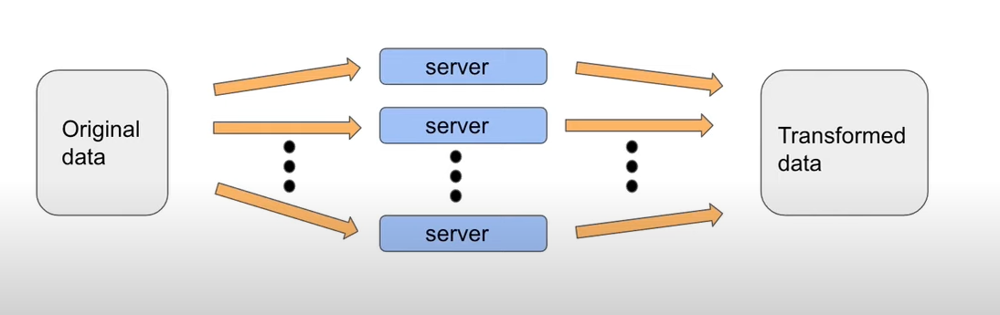
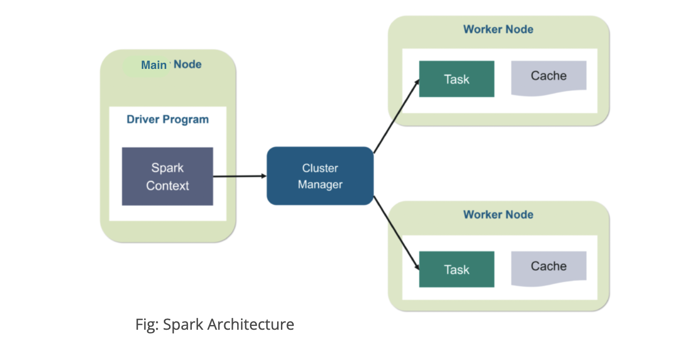

# PySpark

## It Started with Apache Spark 

Apache Spark is an open-source, distributed processing system used for big data workloads. It utilizes in-memory caching, and optimized query execution for fast analytic queries against data of any size. It provides development APIs in Java, Scala, Python and R, and supports code reuse across multiple workloads—batch processing, interactive queries, real-time analytics, machine learning, and graph processing. 


## Spark architecture 

Spark allows to run computing in parallel instead of in sequential order. It divded one big task into multiple smaller taks for efficiency, each task runs seprately on a different machine. 



To send commands and receive results from a cluster, you will need to initiate a spark session. 

```
from pyspark.sql import SparkSession
spark = SparkSession.builder.appName('session').getOrCreate() # will return existing session if one was
                                                           # created before and was not closed
```

This object is your tool for interacting with Spark. Each user of the cluster will have its own Spark Session, that will allow us use the cluster in isolation. All of the sessions are communicating with the main node in the cluster. Main node assigns each of computers in the cluster tasks and coordinates them. Those computers are worker nodes. In order to connect to a worker node, the main node needs to get that node's computing power allocated to it. Allocation of cluster resources is performed by a cluster manager. Each worker node run tasks in parrallel with other worker node and has its own cache for storing results.




## What is PySpark?

Pyspark is a python API for working with Spark. 

Python API is a tool you can use with the syntax and agility of python to interact with and send commands to a system that is not based on python.

Usually, we would define the amount of data that suits PySpark as what would not fit into single-machine storage (let alone RAM).

Important related concepts:

**Distributed computing** - when you distribute a task into several smaller tasks and run all of them at the same time. Pyspark allows you to do it on multiple machines, but it can also be done on a single machine with several threads.

**Cluster** - a network of machines that can take on tasks from a user, interact with one another and return results. 

**Resilient Distributed Dataset (RDD)** was the primary user-facing API in Spark since its inception. At the core, an RDD is an immutable distributed collection of elements of your data, partitioned across nodes in your cluster that can be operated in parallel with a low-level API that offers transformations and actions.

Part of PySpark we will cover:


### PySparkSQL
A PySpark library to apply SQL-like analysis on a huge amount of structured or semi-structured data. We can also use SQL queries with PySparkSQL.

### MLlib
MLlib is a wrapper over the PySpark and it is Spark’s machine learning (ML) library. This library uses the data parallelism technique to store and work with data. The machine-learning API provided by the MLlib library is quite easy to use. MLlib supports many machine-learning algorithms for classification, regression, clustering, collaborative filtering, dimensionality reduction, and underlying optimization primitives.

### GraphFrames
The GraphFrames is a purpose graph processing library that provides a set of APIs for performing graph analysis efficiently, using the PySpark core and PySparkSQL. It is optimized for fast distributed computing. 

Advantages of using PySpark: 
• Python is very easy to learn and implement. 
• It provides simple and comprehensive API. 
• With Python, the readability of code, maintenance, and familiarity is far better. 
• It features various options for data visualization, which is difficult using Scala or Java.  

## How to get started 

1. Download Anaconda. In case you are not aware Anaconda is the most used distribution platform for python & R programming languages in the data science & machine learning community as it simplifies the installation of packages like PySpark, pandas, NumPy, SciPy, and many more.

You can install anaconda following this [link](https://www.anaconda.com/products/distribution). 

OR 

Uing Brew

```
brew install --cask anaconda
```
2. Python 3.4+ is required for the latest version of PySpark, so make sure you have it installed before continuing. (Earlier Python versions will not work.)

```
python3 --version
```

```
sudo apt install python3-pip
```

3. Install Jupyter Notebook if you do not already have one. 

```
pip install notebook
```

4. Clone this directory and navigate to the base of this directory. 
5. You can also avoid using anaconda and install packages separatly using pip and brew. 
```
brew install openjdk@11
export JAVA_HOME=/usr/local/opt/openjdk@11
pip install pyspark
````

6. Create an anaconda environment using *environment.yaml* file. 

```
conda env create -f environment.yml
conda activate pyspark-tutorial

```
7. Addinng pyspark-tutorial environment to jupyter notebook. 

```
python -m ipykernel install --user --name=pyspark-tutorial
```

8. Strart jupyter notebook 

```
jupyter notebook
```

9. Navigate to a notebook directory and open a *MEDV_predictions.ipynb* notebook. 


10. *Pyspark-tutorial* should automatically be your environment in the notebook. 


