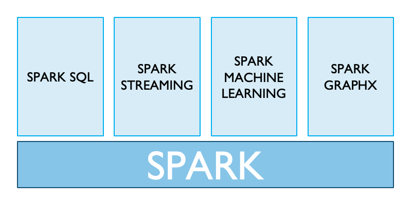
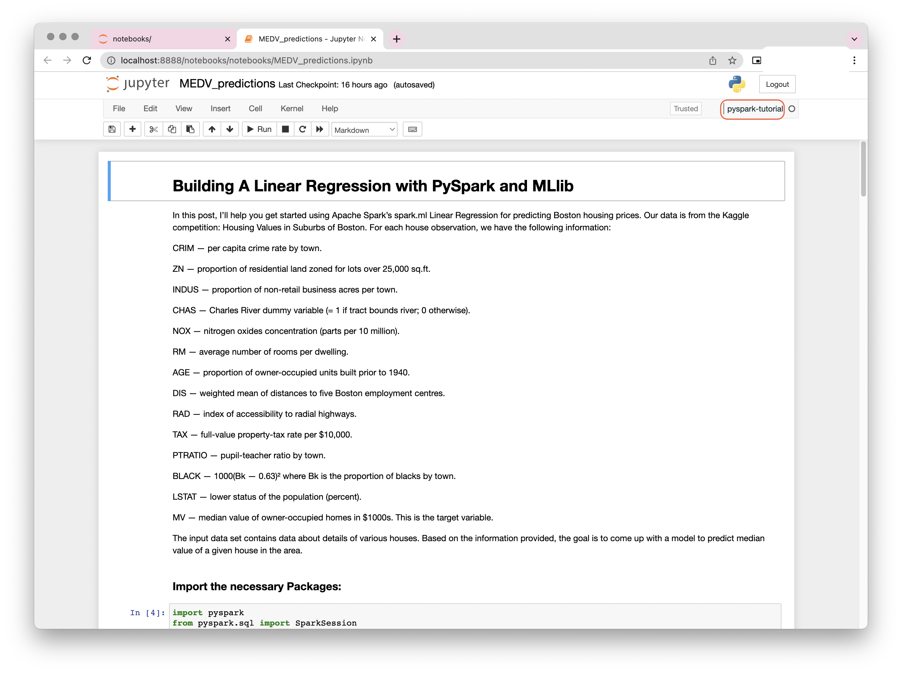

# PySpark

## It Started with Apache Spark 

Apache Spark is an open-source, distributed processing system used for big data workloads. It utilizes in-memory caching, and optimized query execution for fast analytic queries against data of any size. It provides development APIs in Java, Scala, Python and R, and supports code reuse across multiple workloads—batch processing, interactive queries, real-time analytics, machine learning, and graph processing. 



## What is PySpark?

Pyspark is a python api for working with apache spark. I will first explain what do I mean by a "python api" for something and then explain what, specifically, is 'apache spark'.

what I mean by 'python api' is that you can use the syntex and agility of python to interact with and send commands to a system that is not based, at its core, on python.

With pyspark, you intercat with apache spark - a system designed for working, analyzing and modeling with immense amounts of data in many computers at the same time. putting it in a different way, apache spark allows you to run computations in parallel, instead of sequentially. it allows you to divide one incredibly large task into many smaller tasks, and run each such task on a different machine.this allowes you to accomplish your analysis goals in reasonable time that would not be possible on a single machine.

Usually, we would define the amount of data that suits PySpark as what would not fit into a single machine storage (let alone RAM).

Important related concepts:

distributed computing - when you distribute a task into several smaller task that run at the same time. this is what pyspark allows you to do with many machines, but it can also be done on a single machine with several threads, for example.

cluster - a network of machines that can take on tasks from a user, interact with one another and return results. these provide the computing resources that pyspark will use to make the computations.

Resilient Distributed Dataset (RDD) - an immutable distributed collection of data. it is not tabular, like DataFrames which we will work with later, and has no data schema. therefore, for tabular data wrangling, DataFrames allowes for more API options and uner-then-hood optimizations. still, you might encounter RDDs as you learn more about Spark, and should be aware of their existence.
Part of PySpark we will cover:

Spark Architecture: to send commands and receive results from a cluster, you will need to initiate a spark session. this object is your tool for interacting with Spark. each user of the cluster will have its own Spark Session, that will allow him to use the cluster in isolation from other users. all of the sessions are communicating with a spark context, which is the master node in the cluster - that is, it assigns each of computers in the cluster tasks and coordinates them. each of the computers in the cluster that perform tasks for a master node is called a worker node. to connect to a worker node, the master node needs to get that node's comput power allocated to it, by a cluster manager, that is responsable for distributing the cluster resources. inside each worker node, there are execute programs that run the tasks - they can run multiple tasks simultaneously, and has their own cashe for storing results. so, each master node can have multiple worker nodes, that can have multiple tasks running.


### PySparkSQL
A PySpark library to apply SQL-like analysis on a huge amount of structured or semi-structured data. We can also use SQL queries with PySparkSQL.

### MLlib
MLlib is a wrapper over the PySpark and it is Spark’s machine learning (ML) library. This library uses the data parallelism technique to store and work with data. The machine-learning API provided by the MLlib library is quite easy to use. MLlib supports many machine-learning algorithms for classification, regression, clustering, collaborative filtering, dimensionality reduction, and underlying optimization primitives.

### GraphFrames
The GraphFrames is a purpose graph processing library that provides a set of APIs for performing graph analysis efficiently, using the PySpark core and PySparkSQL. It is optimized for fast distributed computing. 

Advantages of using PySpark: 
• Python is very easy to learn and implement. 
• It provides simple and comprehensive API. 
• With Python, the readability of code, maintenance, and familiarity is far better. 
• It features various options for data visualization, which is difficult using Scala or Java.  

## How to get started 

1. Download Anaconda. In case you are not aware Anaconda is the most used distribution platform for python & R programming languages in the data science & machine learning community as it simplifies the installation of packages like PySpark, pandas, NumPy, SciPy, and many more.

You can install anaconda following this [link](https://www.anaconda.com/products/distribution). 

OR 

Uing Brew

```
brew install --cask anaconda
```
2. Python 3.4+ is required for the latest version of PySpark, so make sure you have it installed before continuing. (Earlier Python versions will not work.)

```
python3 --version
```

```
sudo apt install python3-pip
```

3. Install Jupyter Notebook if you do not already have one. 

```
pip install notebook
```

4. Clone this directory and navigate to the base of this directory. 

5. Create an anaconda environment using *environment.yaml* file. 

```
conda env create -f environment.yml
conda activate pyspark-tutorial

```
6. Addinng pyspark-tutorial environment to jupyter notebook. 

```
python -m ipvkernel install --user --name=pyspark-tutorial
```

7. Strart jupyter notebook 

```
jupyter notebook
```

8. Navigate to a notebook directory and open a *MEDV_predictions.ipynb* notebook. 



9. *Pyspark-tutorial* should automatically be your environment in the notebook. 


